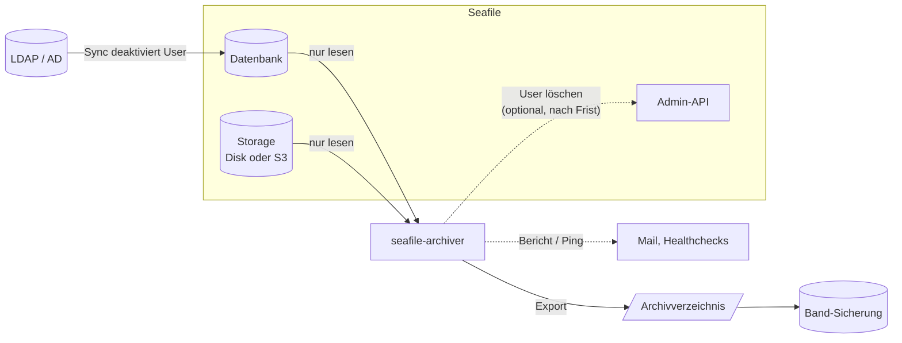
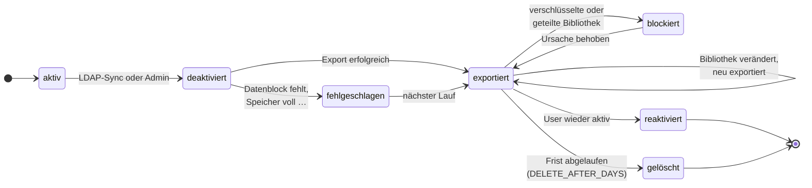

# seafile-archiver

Archiviert die Bibliotheken **deaktivierter Seafile-User** als normale Dateien und Ordner, zum
Beispiel für eine Band-Sicherung, und löscht die User danach auf Wunsch aus Seafile.

Typischer Einsatz: Mitarbeiter verlassen das Unternehmen, ihr Account wird im Active Directory
deaktiviert oder aus der Seafile-Gruppe entfernt. Seafile deaktiviert ihn beim nächsten
LDAP-Sync. Der Archiver bemerkt das in der nächsten Nacht, schreibt alle Bibliotheken des Users
in einen Ordner, den die Band-Sicherung abholt, und entfernt den User nach einer Frist aus
Seafile. Das gibt Speicherplatz und Lizenzen frei.

- Läuft als eigener Docker-Container neben Seafile, **nur mit Lesezugriff** auf Datenbank und Storage
- Exportiert den aktuellen Stand jeder Bibliothek, **prüft jeden Datenblock** und schreibt Prüfsummen
- Löschen ist **aus, bis man es einschaltet**, und wird bei allem Unklaren blockiert
- Bericht per Mail, Überwachung per [Healthchecks](https://healthchecks.io), beides optional



## Voraussetzungen

- Seafile im Docker-Setup. Der Archiver braucht das Seafile-Volume (Konfiguration und Storage)
  und das Docker-Netz der Datenbank.
- **Getestet** mit Seafile Pro 13.0.19, Storage auf Disk und S3 (MinIO), Archivziel lokal und SMB.
  Seafile CE und ältere Versionen sollten funktionieren (gleiches Objektformat und
  Datenbankschema), sind aber nicht getestet. Für CE ohne LDAP `ONLY_LDAP_USERS=false` setzen.
- Ein Archivverzeichnis mit genug Platz, lokal oder als NFS/SMB-Freigabe eingebunden.

## So funktioniert es

Jede Nacht (einstellbar) sucht der Archiver in der Seafile-Datenbank nach **deaktivierten
Usern**. Wer sie deaktiviert hat, spielt keine Rolle: LDAP-Sync (`DEACTIVE_USER_IF_NOTFOUND`)
oder ein Admin. Ein User durchläuft dann diese Zustände:



- **Exportiert** werden alle eigenen Bibliotheken des Users, jeweils der aktuelle Stand (ohne
  Versionshistorie und Papierkorb). Gruppen- und Abteilungsbibliotheken bleiben unberührt.
- **Fehlgeschlagen:** Beschädigte oder fehlende Daten werden nie still übergangen. Die Bibliothek
  wird gemeldet und in jedem Lauf erneut versucht; der User wird so lange nicht gelöscht.
- **Neu exportiert** wird eine Bibliothek, die nach dem Export noch verändert wurde, zum Beispiel
  von Kollegen mit Schreibrecht. Die Löschfrist beginnt dann neu.
- **Blockiert** ist die Löschung, solange der User eine Bibliothek besitzt, die
  - verschlüsselt ist (ohne Passwort nicht exportierbar) oder
  - mit anderen geteilt ist, auch nur ein Unterordner (sonst verlören Kollegen still den
    Zugriff). Die IT entscheidet in Seafile: auf einen Nachfolger **übertragen** (sie bleibt
    erhalten) oder die **Freigabe entfernen** (sie wird mit dem User gelöscht).

  Die Blockade wird einmal gemeldet und löst sich im nächsten Lauf von selbst, sobald die
  Ursache behoben ist.
- **Gelöscht** wird über die Seafile-Admin-API, erst nach `DELETE_AFTER_DAYS` ab dem Export.
  Seafile entfernt dabei auch die Bibliotheken; sie liegen danach noch im Seafile-Papierkorb.
- **Reaktiviert:** Wird ein User wieder aktiviert, bevor die Frist abläuft, wird er nicht
  gelöscht. Das Archiv bleibt liegen.

### Sicherheitsnetze

| Schutz | Wirkung |
|---|---|
| `DRY_RUN=true` (Standard) | Probelauf: zeigt nur, was passieren würde |
| Löschen standardmäßig aus | ohne `DELETE_AFTER_DAYS` wird nie gelöscht |
| `MAX_USERS_PER_RUN` (5) | Sind mehr User *neu* deaktiviert, bricht der Lauf ohne jede Aktion ab. Schützt vor einem kaputten LDAP-Filter, der alle User deaktiviert. |
| `MAX_DELETIONS_PER_RUN` (10) | höchstens so viele Löschungen pro Lauf, der Rest folgt in den nächsten Nächten |
| nur Lesezugriff | Seafile-Volume schreibgeschützt, Datenbank-User mit nur `SELECT`; einzige schreibende Aktion ist das Löschen per API |

### Das Archiv

```
/archiv/
├── bob/                       ← LDAP-Login des Users
│   ├── Projekte/              ← je Bibliothek ein Ordner, Inhalt 1:1
│   ├── Team-Ablage/
│   ├── _manifest.json         ← User, Bibliotheken, Freigaben, Status (maschinenlesbar)
│   ├── _SHA256SUMS            ← Prüfsummen, prüfen mit: sha256sum -c _SHA256SUMS
│   ├── _export.log            ← Protokoll pro Bibliothek
│   └── _UMBENANNT.txt         ← nur falls Namen angepasst werden mussten
├── dave@firma.de/             ← User ohne LDAP: Kontakt-Mail als Ordnername
└── .staging/                  ← unfertige Exporte, von der Band-Sicherung ausnehmen
```

Existiert der Ordner schon (z.B. ein früherer Export desselben Users, der noch nicht vom Band
gelöscht wurde), wird das Datum angehängt: `bob_2026-10-01`.

### Der Bericht

Nach jedem Lauf, in dem etwas passiert ist, kommt eine Mail, zum Beispiel:

```
Seafile-Archivierung, Lauf vom 01.10.2026 01:30

Exportiert:
  - bob (bob@example.com) → /archiv/bob
    Projekte: 1204 Dateien, 3,2 GB
    Team-Ablage: 87 Dateien, 140,5 MB  [geteilt mit: Gruppe Vertrieb]
  Summe: 1 User, 2 Bibliotheken, 3,3 GB

Verschlüsselte Bibliotheken, nicht exportiert (bitte manuell klären):
  - bob: Tresor (c8c48f93-c388-4313-8b25-6a7b26d4d651)
```

## Installation

**1. Projekt holen und konfigurieren**

```bash
git clone https://github.com/datamate-rethink-it/seafile-archiver /opt/seafile-archiver
cd /opt/seafile-archiver
cp .env.example .env    # ausfüllen, siehe „Konfiguration“
mkdir data
```

**2. Datenbank-User mit reinen Leserechten anlegen** (in der MariaDB von Seafile):

```sql
CREATE USER 'archiver'@'%' IDENTIFIED BY '…';
GRANT SELECT ON ccnet_db.*   TO 'archiver'@'%';
GRANT SELECT ON seafile_db.* TO 'archiver'@'%';
GRANT SELECT ON seahub_db.*  TO 'archiver'@'%';
```

**3. Admin-Token erzeugen** (nur nötig, wenn später gelöscht werden soll). Am besten mit einem
eigenen Systemadmin-Account, damit Löschungen im Seafile-Log nachvollziehbar sind:

```bash
curl -d username=<admin> -d password=<passwort> https://seafile.example.com/api2/auth-token/
```

**4. Container starten.** In `compose.example.yml` die Pfade anpassen: Seafile-Volume,
Archivverzeichnis, Docker-Netz der Seafile-Datenbank. Dann:

```bash
docker compose -f compose.example.yml up -d --build
docker exec seafile-archiver seafile-archiver check
```

`check` prüft Datenbank, Storage-Zugriff, Archivverzeichnis und API und zeigt die aktive
Konfiguration.

## Einführung in ein bestehendes System

**Grundannahme: Deaktiviert heißt ausgeschieden.** Jeder deaktivierte User wird archiviert und
(mit `DELETE_AFTER_DAYS`) später gelöscht, auch wenn er schon vor Jahren deaktiviert wurde. Wird
ein Account nur pausiert, etwa wegen Elternzeit, gehört er in `EXCLUDE_USERS`.

Seafile speichert nicht, *wann* ein User deaktiviert wurde. Beim ersten Start gelten deshalb alle
bereits deaktivierten User als neu, und `MAX_USERS_PER_RUN` bricht ab. Der Altbestand wird
einmalig bewusst freigegeben:

1. **Installieren** mit `DRY_RUN=true` und ohne `DELETE_AFTER_DAYS`, dann `check`.
2. **Liste erzeugen.** Die Abbruchmeldung nennt die nötige Zahl:
   ```bash
   docker exec seafile-archiver seafile-archiver run --dry-run --max-users 500
   ```
   Der Bericht zeigt jeden User mit seinen Bibliotheken, deren Größe und die Summe.
3. **Liste durchsehen**, dann Schritt 2 wiederholen, bis sie stimmt:
   - soll archiviert werden: nichts tun
   - kann ohne Archiv weg: vorher in Seafile löschen
   - Account soll bleiben: in `EXCLUDE_USERS` eintragen
4. **Platz prüfen:** Das Archivziel muss die Summe aus Schritt 2 aufnehmen.
5. **Altbestand exportieren:** Für eine Nacht `MAX_USERS_PER_RUN` hochsetzen und
   `DRY_RUN=false`, Container neu starten. Bricht der Lauf ab, macht der nächste mit den
   restlichen Usern weiter. Stichprobe mit `sha256sum -c _SHA256SUMS`, dann auf Band sichern.
6. **Normalbetrieb:** `MAX_USERS_PER_RUN` zurück auf den normalen Wert. Ab jetzt werden nur
   neu deaktivierte User archiviert.
7. **Löschen einschalten**, sobald sich der Ablauf bewährt hat: `DELETE_AFTER_DAYS` setzen,
   deutlich länger als ein Band-Zyklus. Der Altbestand ist dann sofort fällig und wird über
   mehrere Nächte gelöscht (`MAX_DELETIONS_PER_RUN`).

## Bedienung

```bash
docker exec seafile-archiver seafile-archiver check                        # Konfiguration und Verbindungen prüfen
docker exec seafile-archiver seafile-archiver run --dry-run                # Probelauf
docker exec seafile-archiver seafile-archiver run --live                   # echter Lauf, sofort
docker exec seafile-archiver seafile-archiver run --dry-run --max-users 50 # Schwelle für einen Lauf übergehen
docker exec seafile-archiver seafile-archiver status                       # User, Bibliotheken, letzte Läufe
```

Der Container startet die Läufe selbst zu den Zeiten in `SCHEDULE`. Mit leerem `SCHEDULE` kann
man sie auch extern auslösen, z.B. per Ofelia `job-exec` mit `seafile-archiver run`.

## Konfiguration

Alle Einstellungen kommen aus Umgebungsvariablen, eine kommentierte Vorlage ist
[`.env.example`](.env.example). Die wichtigsten:

| Variable | Standard | Bedeutung |
|---|---|---|
| `SEAFILE_MYSQL_DB_HOST`, `_USER`, `_PASSWORD` | `mariadb`, `root`, – | Datenbankzugang, gleiche Namen wie beim Seafile-Container |
| `DRY_RUN` | `true` | Probelauf, nichts wird geschrieben oder gelöscht |
| `DELETE_AFTER_DAYS` | leer | Tage nach dem Export, bis der User gelöscht wird; leer = nie |
| `SEAFILE_URL`, `SEAFILE_API_TOKEN` | – | nur für das Löschen nötig |
| `MAX_USERS_PER_RUN` | `5` | Abbruch, wenn mehr User neu deaktiviert sind |
| `MAX_DELETIONS_PER_RUN` | `10` | höchstens so viele Löschungen pro Lauf |
| `BLOCK_DELETE_IF_SHARED` | `true` | geteilte Bibliotheken blockieren die Löschung |
| `ONLY_LDAP_USERS` | `true` | nur User mit LDAP-Konto; `false` für Seafile ohne LDAP |
| `EXCLUDE_USERS` | leer | kommagetrennt: LDAP-Login, Mail oder Seafile-ID |
| `SCHEDULE` | `01:30` | Uhrzeiten der Läufe, kommagetrennt; leer = extern starten |
| `ARCHIVE_UID`, `ARCHIVE_GID` | root | Besitzer der exportierten Dateien |
| `HEALTHCHECK_URL` | leer | Healthchecks-Ping-URL; leer = aus |
| `MAIL_TO`, `MAIL_FROM`, `SMTP_*` | leer | Mail-Bericht; leeres `MAIL_TO` = aus |
| `SEAF_SERVER_STORAGE_TYPE`, `S3_*` | – | bei S3-Storage dieselben Werte wie im Seafile-Container |

## Betrieb und Grenzen

- **Keine Prüfung der Band-Sicherung.** Gelöscht wird allein nach Ablauf von
  `DELETE_AFTER_DAYS`. Die Frist muss deutlich länger sein als ein Band-Zyklus, mit Reserve für
  eine fehlgeschlagene Sicherung, und die Band-Sicherung muss selbst überwacht werden.
- **Seafile-Papierkorb als Sicherheitsnetz.** Gelöschte Bibliotheken lassen sich dort
  wiederherstellen (Systemverwaltung → Bibliotheken → Papierkorb), solange er nicht geleert
  ist. Danach gehören sie noch dem gelöschten User und müssen auf einen bestehenden Account
  übertragen werden. Speicherplatz wird erst nach dem Leeren und dem GC frei.
- **Lange Läufe.** Gemessen (S3 lokal): etwa 170 MB/s bei großen Dateien, etwa 100 Dateien/s bei
  kleinen. Die Dauer hängt vor allem an der Zahl der Dateien und der Latenz zum Storage; bei
  einem entfernten S3 kann eine Bibliothek mit einer Million Dateien einen Tag brauchen. Der
  Archiver meldet sich währenddessen etwa jede Minute im Log (`PROGRESS_SECONDS`). Läuft beim
  nächsten Start noch ein Lauf, wird der neue ohne Fehler übersprungen. Bei Healthchecks die
  Toleranzzeit (Grace Time) länger wählen als den längsten Lauf.
- **Dateinamen.** Lehnt das Archivziel einen Namen ab (SMB/Windows: `\ ? * | " < >`, reservierte
  Namen wie `CON`) oder kollidiert er, weil das Ziel nicht zwischen Groß- und Kleinschreibung
  unterscheidet (`Datei.txt`/`datei.txt`), wird ein angepasster Name verwendet (`frage_.txt`,
  `Datei (2).txt`) und in `_UMBENANNT.txt` festgehalten. `:` wird immer ersetzt: Auf SMB/NTFS
  würde `a:b.txt` still zur leeren Datei `a` mit verstecktem Inhalt. Manche SMB-Server ändern
  Namen auch ohne Fehler (Samba: `punkt.` wird zu `punkt`); der Inhalt bleibt intakt.
- **Protokoll (`/data`)** als Host-Pfad auf dem Seafile-Server einbinden, damit es im normalen
  Server-Backup enthalten ist, nicht auf einer Netzwerkfreigabe (SQLite verträgt SMB/NFS
  schlecht). Geht es verloren, gelten alle inaktiven User wieder als neu, und
  `MAX_USERS_PER_RUN` bricht ab.
- **Ordner gelöscht, Bibliothek verändert:** Wurde ein Archivordner nach der Band-Sicherung
  schon entfernt und muss eine Bibliothek neu exportiert werden, entsteht ein neuer Ordner nur
  mit dieser Bibliothek.
- **Datenschutz.** Das Archiv enthält personenbezogene Daten, `_manifest.json` zusätzlich Namen
  und Mailadressen. Aufbewahrung und Löschung der Archive regelt der Betreiber.

## Hintergrund

**Wie exportiert wird.** Pro Bibliothek liest der Archiver den aktuellen Stand (Head-Commit)
aus der Datenbank und schreibt dessen Verzeichnisbaum Datei für Datei. Gelesen wird mit
[`seafobj`](https://github.com/haiwen/seafobj), Seafiles eigener Python-Bibliothek, die auch
Seahub verwendet. Jeder Block wird geprüft (die Block-ID ist der SHA1-Hash seines Inhalts),
jede Datei auf ihre Größe. Änderungsdaten, leere Dateien und leere Ordner werden übernommen.
Der Export entsteht in `.staging` und wird erst nach vollständigem Erfolg an seinen Platz
verschoben.

**Warum nicht `seaf-fsck --export`?** Das Bordmittel von Seafile war die erste Idee, hat sich im
Test (Seafile Pro 13.0.19) aber als ungeeignet erwiesen:

| Situation | seaf-fsck --export |
|---|---|
| Fehlende Datenblöcke | exportiert **still einen älteren Stand**, ohne Warnung, Exit-Code 0 |
| Verschlüsselte Bibliothek | `WARNING … export failed`, trotzdem Exit-Code 0 |
| Leere Bibliothek | meldet `No available commits … export failed` |
| Betrieb | braucht das 1,6-GB-Seafile-Image in passender Version |

**Was tun bei einem fehlgeschlagenen Export?** Die Meldung nennt das fehlende oder beschädigte
Objekt. Optionen: Bibliothek aus dem Backup wiederherstellen, mit
`seaf-fsck.sh --repair <repo_id>` auf den letzten intakten Stand zurücksetzen (die betroffenen
Daten sind dann ohnehin verloren) oder die Bibliothek manuell löschen.

**Image.** Schlankes Debian-Image (~260 MB), unabhängig von der Seafile-Version des Servers.
`seafobj` kommt nicht von PyPI, sondern als Tarball eines festen GitHub-Commits
(`SEAFOBJ_COMMIT` im Dockerfile); für ein Update den Commit anpassen und neu bauen. Storage laut
seafobj: Disk, S3, Ceph, Swift (Alibaba OSS bräuchte zusätzlich `oss2`).

## Entwicklung und Test

`test/` enthält eine lokale Testumgebung: Seafile Pro 13 (ohne Lizenz bis 3 User), LDAP
([lldap](https://github.com/lldap/lldap)), Mailpit und einen Healthchecks-Ersatz. `seed.sh`
richtet die Instanz ein und legt Testdaten mit allen Sonderfällen an (verschachtelt, geteilt,
verschlüsselt, leer, beschädigt).

```bash
cd test
cp .env.example .env      # Zufallswerte für die Secrets eintragen
docker compose up -d --build
./seed.sh
# bob in lldap (http://127.0.0.1:17170) aus der Gruppe "seafile" nehmen, dann:
docker compose exec seafile /opt/seafile/seafile-server-latest/pro/pro.py ldapsync
docker compose exec archiver seafile-archiver run --dry-run
# Seafile: http://127.0.0.1:8088, Mails: http://127.0.0.1:8026
```

- **S3:** `compose.s3.yml` ergänzt MinIO und stellt Seafile und Archiver auf S3 um
  (`COMPOSE_FILE=compose.yml:compose.s3.yml`, vorher `docker compose down -v`). MinIO
  veröffentlicht keine Docker-Images mehr; gegebenenfalls einen anderen S3-kompatiblen Server
  einsetzen.
- **SMB:** `compose.smb.yml` ergänzt einen Samba-Server und bindet ihn per CIFS als `/archiv`
  ein. `SMB_MOUNT_OPTS=nomapposix` testet die strenge Variante, bei der SMB Sonderzeichen
  ablehnt.

## Lizenz

[MIT](LICENSE). `seafobj` wird beim Bauen des Images von GitHub geladen und steht unter der
Apache-2.0-Lizenz.
